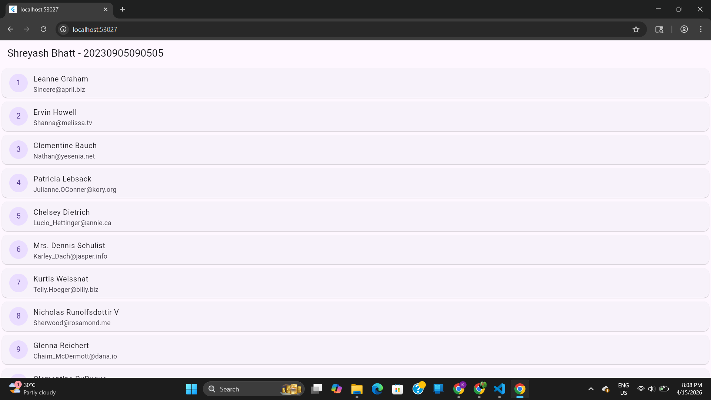

Project Overview
This project is an individual assignment for the Flutter Application Development (FAD) course. It demonstrates the ability to integrate a public REST API into a Flutter mobile application, parse complex JSON data, and display it efficiently to the user.

Description
The application fetches a list of users from the JSONPlaceholder public API. It utilizes the http package for network communication and the dart:convert library to decode JSON responses. The app is built with a FutureBuilder to handle the three states of data retrieval:

Loading: Displays a circular progress indicator.

Success: Populates a dynamic list with user details.

Error: Catches and displays connection or parsing failures.

Technical Specifications
API Endpoint: https://jsonplaceholder.typicode.com/users

Parsing Logic: Converts a JSON array into a dynamic List to extract id, name, and email.

UI Components:

ListView.builder: Used for high-performance scrolling and memory management.

Card & ListTile: Used to organize individual user records visually.

CircleAvatar: Displays the unique ID of each user.

Output Description
When the app runs, the user is presented with a clean interface featuring an AppBar that includes the student's name and enrollment number.

The main body consists of a scrollable list. Each item in the list represents a user with the following details:

Leading Icon: A circular avatar showing the user's numeric ID.

Title: The full name of the user (e.g., "Leanne Graham").

Subtitle: The user's professional email address (e.g., "Sincere@april.biz").

